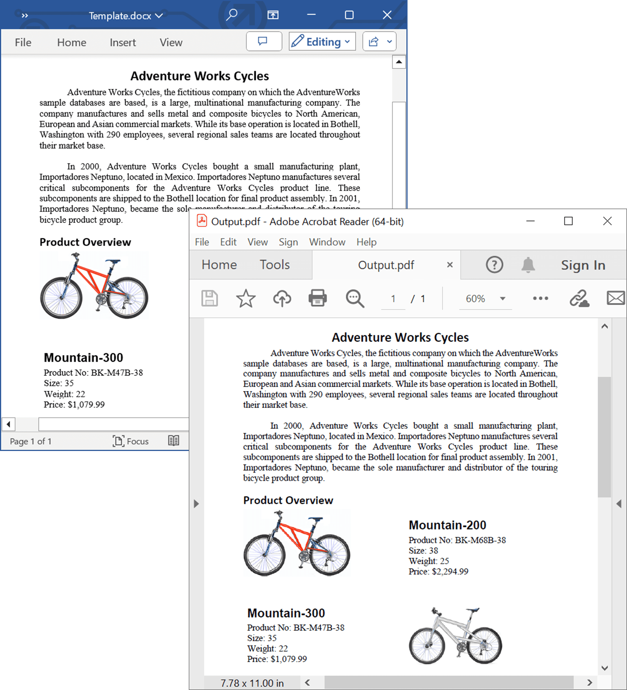

# Convert Word document to PDF with advanced options in C#

This repository contains examples that illustrates how to convert Word documents to PDFs with advanced options programmatically in C#. The Syncfusion&reg; [.NET Word library](https://www.syncfusion.com/document-processing/word-framework/net/word-library?utm_source=github&utm_medium=listing&utm_campaign=github-docio-examples) (DocIO) converts a Word document to PDF with just five lines of code and also it does not require Microsoft Word application to be installed in the machine. It preserves the original appearance of the Word document in the converted PDF.

 
 

## Key Features

- Word to PDF conversions
  - [Convert Word to PDF](https://github.com/SyncfusionExamples/word-to-pdf-conversion-csharp/blob/master/Word-to-PDF-conversions/Convert-Word-to-PDF) - Convert Word document to PDF.
  - [Accessible PDF document](https://github.com/SyncfusionExamples/word-to-pdf-conversion-csharp/blob/master/Word-to-PDF-conversions/Accessible-PDF-document) - Convert Word document to PDF/UA (Section 508 compliant).
  - [PDF conformance level](https://github.com/SyncfusionExamples/word-to-pdf-conversion-csharp/blob/master/Word-to-PDF-conversions/PDF-conformance-level) - Convert Word document to PDF/A with various PDF conformance levels for long-term archiving and standardization.

- Embed fonts
  - [Embed font subset](https://github.com/SyncfusionExamples/word-to-pdf-conversion-csharp/blob/master/Embed-fonts/Embed-font-subset) - Embed only the necessary font subsets to optimize file size.
  - [Embed complete font](https://github.com/SyncfusionExamples/word-to-pdf-conversion-csharp/blob/master/Embed-fonts/Embed-complete-font) - Embed fonts within the PDF for consistent display.

- Word to PDF advanced options
  - [Editable PDF form fields](https://github.com/SyncfusionExamples/word-to-pdf-conversion-csharp/blob/master/Word-to-PDF-advanced-options/Editable-PDF-form-fields) - Preserve Word document form fields as PDF forms, allowing the creation of editable PDFs.
  - [Word headings to PDF bookmarks](https://github.com/SyncfusionExamples/word-to-pdf-conversion-csharp/blob/master/Word-to-PDF-advanced-options/Word-headings-to-PDF-bookmarks) - Convert Word headings to PDF bookmarks, generating PDF documents with bookmarks based on paragraph styles and outline levels.
  - [Optimize identical images](https://github.com/SyncfusionExamples/word-to-pdf-conversion-csharp/blob/master/Word-to-PDF-advanced-options/Optimize-identical-images) - Optimize identical images to reduce PDF file size.
  - [Disable alternate chunks](https://github.com/SyncfusionExamples/word-to-pdf-conversion-csharp/blob/master/Word-to-PDF-advanced-options/Disable-alternate-chunks) - Include or exclude alternate chunks during Word to PDF conversion.
  - [Complex script text](https://github.com/SyncfusionExamples/word-to-pdf-conversion-csharp/blob/master/Word-to-PDF-advanced-options/Complex-script-text) - Convert complex script text accurately.
  - [Hyphenation in Word-to-PDF](https://github.com/SyncfusionExamples/word-to-pdf-conversion-csharp/blob/master/Word-to-PDF-advanced-options/Hyphenation-in-Word-to-PDF) - Use custom dictionaries for text hyphenation in the converted PDF.
  - [Comments in Word-to-PDF](https://github.com/SyncfusionExamples/word-to-pdf-conversion-csharp/blob/master/Word-to-PDF-advanced-options/Comments-in-Word-to-PDF) - Toggle between preserving or excluding comments during Word to PDF conversions.
  - [Restrict permission in PDF](https://github.com/SyncfusionExamples/word-to-pdf-conversion-csharp/blob/master/Word-to-PDF-advanced-options/Restrict-permission-in-PDF) - Restrict permissions in the converted PDF for added security.

- Preserve track changes
  - [Track-changes-in-Word-to-PDF](https://github.com/SyncfusionExamples/word-to-pdf-conversion-csharp/blob/master/Preserve-track-changes/Track-changes-in-Word-to-PDF) - Preserve revision marks of tracked changes in the converted PDF.
  - [Change track changes color](https://github.com/SyncfusionExamples/word-to-pdf-conversion-csharp/blob/master/Preserve-track-changes/Change-track-changes-color) - Customize the color of track changes marks during conversion.
  - [Show or hide revisions in balloons](https://github.com/SyncfusionExamples/word-to-pdf-conversion-csharp/blob/master/Preserve-track-changes/Show-or-hide-revisions-in-balloons) - Show or hide revisions in balloons during conversion.

- Fallback fonts
  - [Default fallback fonts](https://github.com/SyncfusionExamples/word-to-pdf-conversion-csharp/blob/master/Fallback-fonts/Default-fallback-fonts) - Initialize default fallback fonts for a smoother conversion
  - [Based on script type](https://github.com/SyncfusionExamples/word-to-pdf-conversion-csharp/blob/master/Fallback-fonts/Based-on-script-type) - Set fallback fonts based on script type for unsupported glyphs.
  - [For range of Unicode](https://github.com/SyncfusionExamples/word-to-pdf-conversion-csharp/blob/master/Fallback-fonts/For-range-of-Unicode) - Set fallback fonts for characters when glyphs are not available.

- Font substitution
  - [Alternate font from installed](https://github.com/SyncfusionExamples/word-to-pdf-conversion-csharp/blob/master/Font-substitution/Alternate-font-from-installed) - Use alternate installed fonts when the original fonts are not available during Word to PDF conversion.
  - [Alternate font without installing](https://github.com/SyncfusionExamples/word-to-pdf-conversion-csharp/blob/master/Font-substitution/Alternate-font-without-installing) - Use alternate fonts without requiring font installation.

## Syncfusion&reg; .NET Word Library
The Syncfusion&reg; DocIO is a [.NET Word library](https://www.syncfusion.com/document-processing/word-framework/net/word-library?utm_source=github&utm_medium=listing&utm_campaign=github-docio-examples) allows you to add advanced Word document processing functionalities to any .NET application and does not require Microsoft Word application to be installed in the machine. It is a non-UI component that provides a full-fledged document instance model similar to the Microsoft Office COM libraries to iterate with the document elements explicitly and perform necessary manipulation. 

Take a moment to peruse the [documentation](https://help.syncfusion.com/document-processing/word/word-library/net/overview?utm_source=github&utm_medium=listing&utm_campaign=github-docio-examples), where you can find basic Word document processing options along with the features like [mail merge](https://help.syncfusion.com/document-processing/word/word-library/net/working-with-mail-merge?utm_source=github&utm_medium=listing&utm_campaign=github-docio-examples), [merge](https://help.syncfusion.com/document-processing/word/word-library/net/word-document/merging-word-documents?utm_source=github&utm_medium=listing&utm_campaign=github-docio-examples), [split](https://help.syncfusion.com/document-processing/word/word-library/net/word-document/split-word-documents?utm_source=github&utm_medium=listing&utm_campaign=github-docio-examples) and [compare documents](https://help.syncfusion.com/document-processing/word/word-library/net/word-document/compare-word-documents?utm_source=github&utm_medium=listing&utm_campaign=github-docio-examples), [find and replace](https://help.syncfusion.com/document-processing/word/word-library/net/working-with-find-and-replace?utm_source=github&utm_medium=listing&utm_campaign=github-docio-examples) text in the Word document, [protect](https://help.syncfusion.com/document-processing/word/word-library/net/working-with-security?utm_source=github&utm_medium=listing&utm_campaign=github-docio-examples) the Word documents, and most importantly, the [PDF](https://help.syncfusion.com/document-processing/word/conversions/word-to-pdf/overview?utm_source=github&utm_medium=listing&utm_campaign=github-docio-examples) and [Image](https://help.syncfusion.com/document-processing/word/conversions/word-to-image/overview?utm_source=github&utm_medium=listing&utm_campaign=github-docio-examples) conversions with code examples.

Compatible Microsoft Word Versions
----------------------------------

*   Microsoft Word 97-2003
*   Microsoft Word 2007
*   Microsoft Word 2010
*   Microsoft Word 2013
*   Microsoft Word 2016
*   Microsoft Word 2019
*   Microsoft 365

Supported File Formats
----------------------

*   Creates, reads, and edits popular text file formats like [DOC](https://help.syncfusion.com/document-processing/word/word-library/net/word-file-formats#doc-to-docx-and-docx-to-doc?utm_source=github&utm_medium=listing&utm_campaign=github-docio-examples), DOT, [DOCM](https://help.syncfusion.com/document-processing/word/word-library/net/word-file-formats#macros?utm_source=github&utm_medium=listing&utm_campaign=github-docio-examples), DOTM, [DOCX](https://help.syncfusion.com/document-processing/word/word-library/net/word-file-formats#doc-to-docx-and-docx-to-doc?utm_source=github&utm_medium=listing&utm_campaign=github-docio-examples), [DOTX](https://help.syncfusion.com/document-processing/word/word-library/net/word-file-formats#templates?utm_source=github&utm_medium=listing&utm_campaign=github-docio-examples), [HTML](https://help.syncfusion.com/document-processing/word/word-library/net/html?utm_source=github&utm_medium=listing&utm_campaign=github-docio-examples), [RTF](https://help.syncfusion.com/document-processing/word/word-library/net/rtf?utm_source=github&utm_medium=listing&utm_campaign=github-docio-examples), [TXT](https://help.syncfusion.com/document-processing/word/word-library/net/text?utm_source=github&utm_medium=listing&utm_campaign=github-docio-examples), and [XML (WordML)](https://help.syncfusion.com/document-processing/word/word-library/net/word-file-formats#word-processing-xml-xml?utm_source=github&utm_medium=listing&utm_campaign=github-docio-examples).
*   Converts Word documents also to [PDF](https://help.syncfusion.com/document-processing/word/conversions/word-to-pdf/overview?utm_source=github&utm_medium=listing&utm_campaign=github-docio-examples), [Image](https://help.syncfusion.com/document-processing/word/conversions/word-to-image/overview?utm_source=github&utm_medium=listing&utm_campaign=github-docio-examples), and [ODT](https://help.syncfusion.com/document-processing/word/word-library/net/word-to-odt?utm_source=github&utm_medium=listing&utm_campaign=github-docio-examples) files.

## How to run the examples
- Download this project to a location in your disk.
- Open the solution file using Visual Studio.
- Rebuild the solution to install the required NuGet packages.
- Run the application.

## Resources

- **Product page:** [Syncfusion&reg; Word Framework](https://www.syncfusion.com/document-processing/word-framework/net?utm_source=github&utm_medium=listing&utm_campaign=github-docio-examples)
- **Documentation:** [Convert Word document to PDF using Syncfusion&reg; Word library](https://help.syncfusion.com/document-processing/word/conversions/word-to-pdf/net/word-to-pdf?utm_source=github&utm_medium=listing&utm_campaign=github-docio-examples)
- **GitHub Examples:** [Syncfusion&reg; Word library examples](https://github.com/SyncfusionExamples/DocIO-Examples?utm_source=github&utm_medium=listing&utm_campaign=github-docio-examples)
- **Online demo:** [Syncfusion&reg; Word library - Online demos](https://ej2aspnetcore.azurewebsites.net/aspnetcore/word/wordtopdf#/material3)

## Support and feedback
For any other queries, reach our [Syncfusion&reg; support team](https://support.syncfusion.com/?utm_source=github&utm_medium=listing&utm_campaign=github-docio-examples) or post the queries through the [community forums](https://www.syncfusion.com/forums?utm_source=github&utm_medium=listing&utm_campaign=github-docio-examples).

Request new feature through [Syncfusion&reg; feedback portal](https://www.syncfusion.com/feedback?utm_source=github&utm_medium=listing&utm_campaign=github-docio-examples).

## License
This is a commercial product and requires a paid license for possession or use. Syncfusion's licensed software, including this component, is subject to the terms and conditions of [Syncfusion's EULA](https://www.syncfusion.com/license/studio/22.2.5/syncfusion_essential_studio_eula.pdf?utm_source=github&utm_medium=listing&utm_campaign=github-docio-examples). You can purchase a licnense [here](https://www.syncfusion.com/sales/products?utm_source=github&utm_medium=listing&utm_campaign=github-docio-examples) or start a free 30-day trial [here](https://www.syncfusion.com/account/manage-trials/start-trials?utm_source=github&utm_medium=listing&utm_campaign=github-docio-examples).
